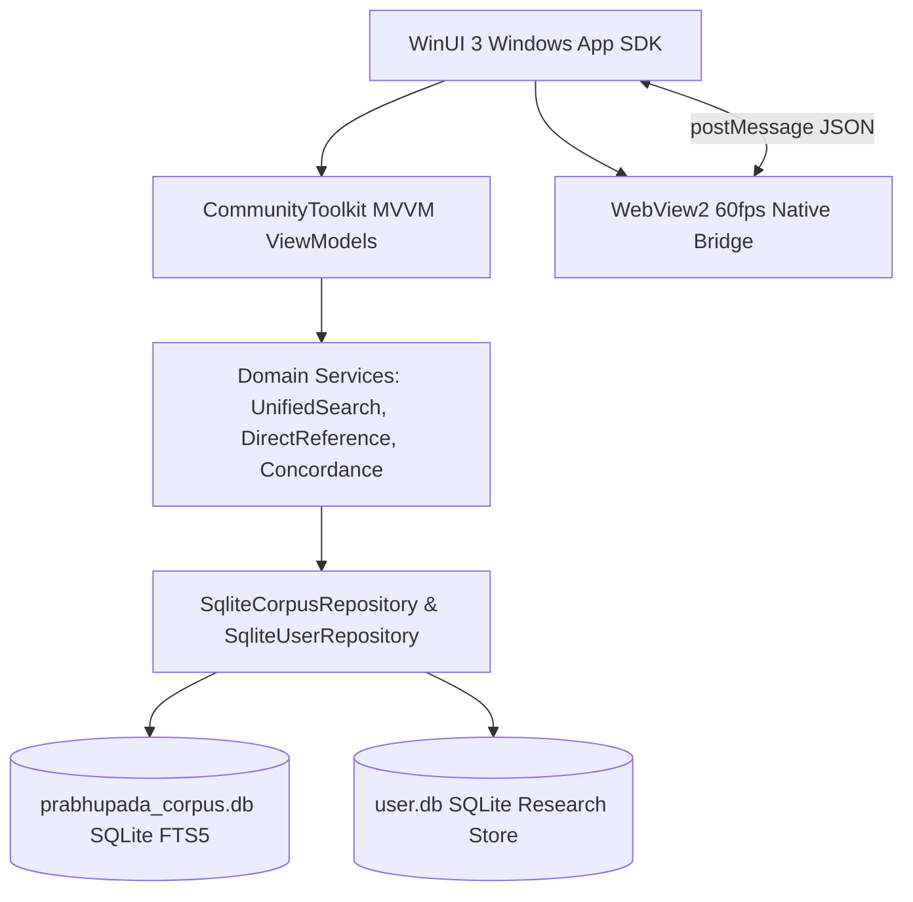

# 🪷 Prabhupāda Connect (VedaBase Modern)

[](https://dotnet.microsoft.com/)
[](https://learn.microsoft.com/windows/apps/winui/)
[](https://sqlite.org/)
[](LICENSE)
[](CONTRIBUTING.md)

> **A high-performance, open-source research sanctuary and digital library for the complete teachings, translations, and commentaries of His Divine Grace A.C. Bhaktivedanta Swami Prabhupāda.**

---

## 📑 Table of Contents

- [🌸 Welcome to Prabhupāda Connect](#-welcome-to-prabhupāda-connect)
- [🚀 Quickstart: How to Install & Run (Zero Tech Knowledge Required)](#-quickstart-how-to-install--run-zero-tech-knowledge-required)
- [🖥️ Easy Desktop Access (No Digging Through Folders)](#-easy-desktop-access-no-digging-through-folders)
- [📤 How to Share the App with Others](#-how-to-share-the-app-with-others)
- [💾 Moving to a New Computer: Never Lose Your Notes or Highlights](#-moving-to-a-new-computer-never-lose-your-notes-or-highlights)
- [☁️ Free Cloud Sync with Supabase (Multi-Device Sync)](#️-free-cloud-sync-with-supabase-multi-device-sync)
  - [🛡️ Keeping Supabase Free Tier Awake Forever (GitHub Action)](#-keeping-supabase-free-tier-awake-forever-github-action)
- [✨ Key Features for Devotees & Daily Readers](#-key-features-for-devotees--daily-readers)
- [🔍 Advanced Search & Scholar Tools](#-advanced-search--scholar-tools)
- [🏛️ Architecture & Developer Guide](#️-architecture--developer-guide)
  - [Tech Stack Overview](#tech-stack-overview)
  - [Repository Layout](#repository-layout)
  - [Building from Source & Running Tests](#building-from-source--running-tests)
- [📱 Mobile App Roadmap (Android Client)](#-mobile-app-roadmap-android-client)
- [📜 License & Dedication](#-license--dedication)

---

## 🌸 Welcome to Prabhupāda Connect

**Prabhupāda Connect** is an open-source digital library created to make the sublime teachings of Śrīla Prabhupāda accessible, searchable, and inspiring for everyone:

- **For Everyday Readers & Devotees**: A clean, distraction-free reading experience with golden verse hyperlinks, soothing eye-friendly themes (Dark, Sepia, Light), word-for-word Sanskrit synonyms, and metric chanting guides.
- **For Serious Researchers & Scholars**: Sub-millisecond direct citation navigation (`@BG 4.9`, `@SB 10.14.8`), SQLite FTS5 proximity search (`NEAR/w5`), reverse concordance word lookups, and personal realization journaling with `[[wiki-links]]`.
- **For Open-Source Developers**: A modern, decoupled architecture built on .NET 10, WinUI 3, and GPU-accelerated WebView2, with 134 automated tests ensuring total text fidelity and zero broken verses.

---

## 🚀 Quickstart: How to Install & Run (Zero Tech Knowledge Required)

You do **not** need any programming background to run Prabhupāda Connect on your Windows computer.

### Step 1: Install the Free .NET 10 Runtime
If your system does not already have .NET 10 installed:
1. Download the official free **[.NET 10 Desktop Runtime](https://dotnet.microsoft.com/download/dotnet/10.0)** for Windows (x64).
2. Double-click the downloaded file and click **Install**.

### Step 2: Download or Clone the App
- **Option A (Simplest)**: Download the repository as a ZIP archive by clicking the green **Code** button at the top of GitHub $\rightarrow$ **Download ZIP**, then extract the ZIP folder to your computer (e.g. `C:\PrabhupadaConnect` or your Documents folder).
- **Option B (Using Git & Git LFS)**:
  ```powershell
  git clone https://github.com/itzabhinav01/prabhupada-connect.git
  cd prabhupada-connect
  git lfs pull
  ```

### Step 3: Start the App with 1 Click
Open the extracted/cloned folder and **double-click**:
👉 **`Launch.bat`**

The launcher will automatically configure background services and launch the app smoothly!

---

## 🖥️ Easy Desktop Access (No Digging Through Folders)

You don't need to search through nested subfolders every time you want to read scripture.

### Create a Desktop Shortcut in 2 Seconds
Inside the main app folder, simply **double-click**:
👉 **`Create-Desktop-Shortcut.bat`**

This creates a golden **Prabhupāda Connect** shortcut icon directly on your Windows Desktop! From then on, you can start your daily reading anytime straight from your desktop with one double-click.

*(For developers and advanced users: The compiled executable is located at `App\VedaBaseModern2.UI\bin\Release\net10.0-windows10.0.26100.0\win-x64\VedaBaseModern2.UI.exe`)*.

---

## 📤 How to Share the App with Others

Want to share Prabhupāda Connect with friends, family, or your local temple community?

1. **Prepare the Package**:
   - Ensure the app has been built once (or run `Launch.bat` once to confirm it runs).
   - Ensure the `Database\prabhupada_corpus.db` file is present in the `Database\` folder.
2. **Zip the Folder**:
   - Right-click the `prabhupada-connect` folder $\rightarrow$ **Compress to ZIP file**.
3. **Share via USB Drive or Cloud Drive**:
   - Share the ZIP via Google Drive, Telegram, or a USB drive.
4. **Recipient's Instructions**:
   - The recipient only needs to extract the ZIP and double-click `Launch.bat` (or `Create-Desktop-Shortcut.bat`). Everything is 100% self-contained!

---

## 💾 Moving to a New Computer: Never Lose Your Notes or Highlights

Your personal realizations, verse highlights, and bookmarks represent precious devotional study and should never be lost when you switch laptops or upgrade Windows.

### Method 1: Built-in 1-Click Backup & Restore (Recommended)
1. **On your old computer**:
   - Open Prabhupāda Connect.
   - Click the **⚙️ Settings** icon in the sidebar (or top right menu).
   - Scroll to **Research Backup & Restore** and click **Export Backup**.
   - Save your `.vdbbackup` archive to a USB drive or cloud storage.
2. **On your new computer**:
   - Install and open Prabhupāda Connect.
   - Go to **Settings $\rightarrow$ Research Backup & Restore**.
   - Click **Import / Restore Backup** and select your `.vdbbackup` file.
   - All your highlights, notes, and bookmarks will be restored with 100% accuracy!

### Method 2: Direct Database Copy
All your personal data is stored in a clean, lightweight SQLite database called **`user.db`** located inside the application's `Database\` folder:
```
Database\user.db
```
Simply copy `user.db` from your old computer's `Database\` folder and paste it into the `Database\` folder on your new computer. All research will resume right where you left off.

---

## ☁️ Free Cloud Sync with Supabase (Multi-Device Sync)

Prabhupāda Connect includes native cloud synchronization backed by **Supabase** (open-source PostgreSQL). This allows you to sync your notes, bookmarks, and highlights seamlessly across multiple computers.

### 5-Minute Free Setup:
1. **Create a Free Supabase Account**: Sign up for free at **[supabase.com](https://supabase.com)** and create a new project (e.g. `prabhupada-connect`).
2. **Apply the Provided Database Schema**:
   - In your Supabase dashboard, click on the **SQL Editor** tab on the left.
   - Open the file [`App/VedaBaseModern2.Core/Sync/supabase_schema.sql`](App/VedaBaseModern2.Core/Sync/supabase_schema.sql) from this repository.
   - Copy the SQL code, paste it into the Supabase SQL Editor, and click **Run**.
3. **Get Your API Credentials**:
   - In Supabase, go to **Project Settings** (gear icon) $\rightarrow$ **API**.
   - Copy your **Project URL** (e.g. `https://yourproject.supabase.co`).
   - Copy your **anon / public** API Key.
4. **Connect in the App**:
   - Open Prabhupāda Connect $\rightarrow$ **Settings $\rightarrow$ Cloud Sync**.
   - Paste your Project URL and Anon Key, enter your email and password, and click **Connect**.
   - Your research is now safely backed up in the cloud with Row Level Security (RLS)!

---

### 🛡️ Keeping Supabase Free Tier Awake Forever (GitHub Action)

> **Important Note on Supabase Free Tier**: Supabase automatically pauses free projects if they receive no database queries for 7 consecutive days. 

To ensure your free database **never pauses**, this repository includes a pre-configured automated GitHub Action:
📂 [`.github/workflows/supabase-keepalive.yml`](.github/workflows/supabase-keepalive.yml)

#### How to Activate It in 1 Minute:
1. Fork or push this repository to your personal GitHub account.
2. In your GitHub repository, navigate to **Settings** $\rightarrow$ **Secrets and variables** $\rightarrow$ **Actions**.
3. Click **New repository secret** and add:
   - Name: `SUPABASE_URL` | Value: Your Supabase Project URL (`https://yourproject.supabase.co`)
   - Name: `SUPABASE_ANON_KEY` | Value: Your Supabase Anon Public Key
4. That's it! GitHub Actions will automatically send a lightweight health check to your Supabase project every 3 days. Your free Supabase sync will **stay active forever** without pausing!

---

## ✨ Key Features for Devotees & Daily Readers

- **Complete Sacred Canon**: *Bhagavad-gītā*, *Śrīmad-Bhāgavatam* (Cantos 1–12), *Caitanya-caritāmṛta* (Ādi, Madhya, Antya), *Nectar of Devotion*, *Kṛṣṇa Book*, *Teachings of Queen Kuntī*, *Śrī Īśopaniṣad*, *Prabhupāda-līlāmṛta*, *Prabhupāda Ślokas*, and all small books.
- **60 FPS GPU-Accelerated Reading**: Native smooth scrolling with custom HTML5/CSS typography that renders complex Sanskrit ligatures flawlessly.
- **Eye-Care Themes**: Instant switching between Obsidian Dark, Deep Forest, Warm Sepia, and Morning Light.
- **Interactive Sanskrit Synonyms**: Click or hover on Sanskrit and Bengali words to inspect their word-for-word grammatical meanings.
- **Sanskrit Prosody & Meter Identification**: Identifies Vedic meters (*Anuṣṭubh*, *Triṣṭubh*, *Jagatī*, etc.) and includes a rhythmic chanting pulse synthesizer to guide vocal recitation.
- **Color-Coded Highlights**: Highlight verses and purports in 5 devotional shades (Golden Yellow, Basil Green, Sky Blue, Lotus Rose, Royal Purple).
- **Study Notes with Golden Wiki-Links**: Type `[[BG 18.66]]` or `[[SB 1.2.6]]` in any realization note to create instant clickable hyperlinks into scripture.

---

## 🔍 Advanced Search & Scholar Tools

- **Pure Canonical Scriptural Progression**:
  When sorting by **Canonical Order**, search results strictly follow the chronological scriptural order:
  $$\text{Canto 1} \longrightarrow \text{Canto 2} \longrightarrow \text{Canto 3} \dots \longrightarrow \text{Canto 12}$$
  No scrambled chapters. No missing cantos.
- **Best Match (Relevance Sorting)**:
  BM25 full-text ranking combined with exact pratīka verse openings. Searching `tat` immediately highlights `tat te 'nukāmpāṁ...` (*SB 10.14.8*) on Page 1.
- **Direct Citation Resolving (`@`)**:
  Type `@` followed by any verse reference in the search box (e.g. `@BG 2.13`, `@SB 1.1.1`, `@CC Madhya 22.83`, `@SPS 10.32`, `@ISO 1`) to jump to that verse instantly.
- **Folio Proximity & Boolean Search**:
  - `krishna w/5 arjuna` (words within 5 words of each other).
  - `bhakti NEAR/10 yoga`.
  - `"supreme personality of godhead"` (exact phrase matching).
  - Match Exact Case toggle.
- **Reverse Concordance Engine**:
  Click any Sanskrit root or word to reveal every location where that word appears across all 40+ books in the corpus.

---

## 🏛️ Architecture & Developer Guide

Prabhupāda Connect is engineered with a strict clean-architecture separation:



### Tech Stack Overview
- **C# 13 / .NET 10** (`net10.0-windows10.0.26100.0`)
- **Windows App SDK / WinUI 3** with modern Fluent Design & Mica material
- **Microsoft WebView2** for desktop-class typography and interactive lemmas
- **SQLite 3 with FTS5** using BM25 ranking and custom Sanskrit stemmers
- **CommunityToolkit.Mvvm** for reactive property bindings and relay commands

### Repository Layout
- `App/VedaBaseModern2.Core/`: Portable domain library containing data models, SQLite repositories, and search algorithms.
- `App/VedaBaseModern2.UI/`: WinUI 3 presentation layer with XAML views, ViewModels, and WebView2 reader assets.
- `Database/`: Contains `prabhupada_corpus.db` (tracked via Git LFS).
- `tests/`: 134 automated regression tests verifying search sequences, exact citations, and text integrity.
- `tools/`: Ingestion and validation scripts for the corpus pipeline.

### Building from Source & Running Tests

```powershell
# Restore and build the solution
dotnet build App/VedaBaseModern2.UI/VedaBaseModern2.UI.csproj -c Release

# Execute the automated test suite (134/134 passing)
dotnet run --project tests/VedaBaseModern2.Tests/VedaBaseModern2.Tests.csproj

# Run the app
./Launch.ps1
```

---

## 📱 Mobile App Roadmap (Android Client)

We are actively designing a high-performance **Android version** of Prabhupāda Connect to bring this research workstation to mobile devices!

### Target Mobile Specifications:
- **UI Framework**: Modern **Jetpack Compose** with Material 3 Devotional Theme.
- **Fluidity**: 120Hz smooth scrolling for long purports and word-for-word Sanskrit synonyms.
- **Cross-Platform Core**: Kotlin Multiplatform (KMP) sharing the same SQLite FTS5 search engine and canonical sorting logic.
- **Offline First**: Complete offline reading capability with on-device SQLite database.
- **Audio Integration**: Spoken classes, morning walk recordings, and rhythmic chanting pulse.

Devotees and developers with Android, Kotlin, or Compose experience are warmly invited to contribute!

---

## 📜 License & Dedication

This project is licensed under the **[MIT License](LICENSE)**.

All original translations and purports of His Divine Grace A.C. Bhaktivedanta Swami Prabhupāda are the intellectual property of the **Bhaktivedanta Book Trust (BBT)**. This open-source software is developed as an act of humble devotional service to facilitate scholarly study and spiritual realization.

---

*“This Kṛṣṇa consciousness movement is not a manufactured idea. It is authorized, scientific, and based on the Vedic scriptures. If anyone takes advantage of this literature, their life will be successful.”*
— **His Divine Grace A.C. Bhaktivedanta Swami Prabhupāda**
