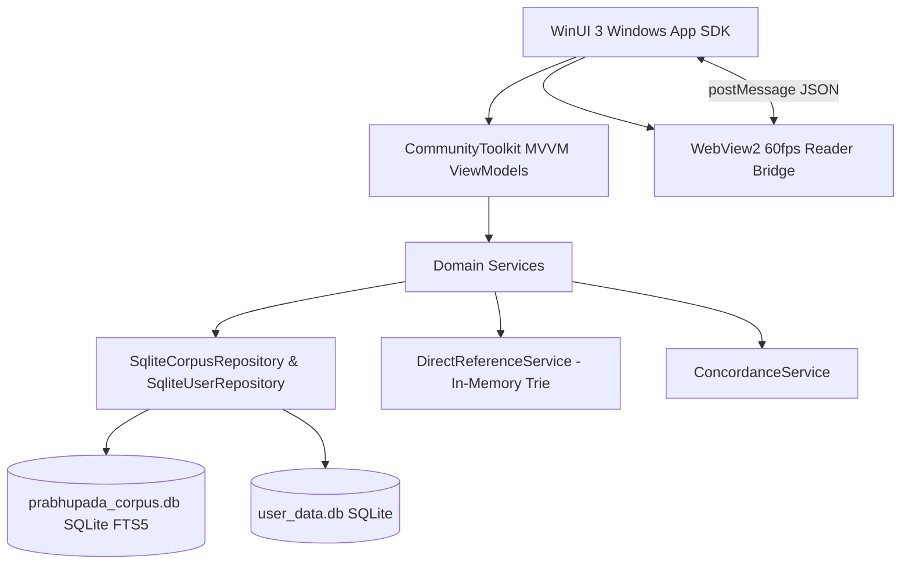

# 🪷 Prabhupāda Connect (VedaBase Modern)

[](https://dotnet.microsoft.com/)
[](https://learn.microsoft.com/windows/apps/winui/)
[](https://sqlite.org/)
[](LICENSE)
[](CONTRIBUTING.md)

> **An open-source, ultra-high-performance research sanctuary and digital library for the complete teachings, translations, and commentaries of His Divine Grace A.C. Bhaktivedanta Swami Prabhupāda.**

---

## 🌟 Vision & Mission

**Prabhupāda Connect** is designed from the ground up for two audiences:
1. **The Neophyte & Daily Reader**: A serene, distraction-free, beautifully formatted reading experience with golden verse citations, soothing dark/light/sepia themes, and effortless navigation through sacred texts.
2. **The Scholar & Serious Researcher**: An uncompromising, lightning-fast research workstation featuring exact citation resolving, SQLite FTS5 full-text proximity search (`NEAR/w5`), authentic Devanagari typography, word-for-word Sanskrit synonyms, reverse concordance lemma exploration, prosody/meter analysis, and personal realization journaling with `[[wiki-links]]`.

---

## ✨ Features at a Glance

### 📖 Complete Canonical Prabhupāda Corpus
- **Major Scriptures**: *Bhagavad-gītā As It Is* (1972 Complete Edition), *Śrīmad-Bhāgavatam* (Cantos 1 through 12), *Śrī Caitanya-caritāmṛta* (Ādi, Madhya, and Antya-līlā).
- **Core Theological Treatises**: *The Nectar of Devotion* (Bhakti-rasāmṛta-sindhu), *Teachings of Lord Caitanya*, *Kṛṣṇa: The Supreme Personality of Godhead*, *Śrī Īśopaniṣad*, *The Nectar of Instruction* (Upadeśāmṛta).
- **Philosophical Classics & Anthologies**: *Brahmā-saṁhitā*, *Mukunda-mālā-stotra*, *Nārada-bhakti-sūtra*, *Teachings of Queen Kuntī*, *Teachings of Lord Kapila*, *Easy Journey to Other Planets*, *Science of Self-Realization*, *Beyond Birth and Death*, and all historical small books.
- **Biographies & Comprehensive Compilations**:
  - *Śrīla Prabhupāda-līlāmṛta* (all 55 chapters across 6 volumes).
  - *Śrīla Prabhupāda Ślokas* (SPS) — 887 authentic Sanskrit verses cited by Śrīla Prabhupāda outside BG, SB, and CC (*Kaṭha Upaniṣad*, *Śvetāśvatara Upaniṣad*, *Vedānta-sūtra*, *Padma Purāṇa*, *Bhakti-rasāmṛta-sindhu*, etc.), linked directly to their primary scripture locations!

---

### 🔍 Search & Discovery Engine
- **Pure Canonical Scriptural Progression**: In **Canonical Order** mode, search results strictly follow the sacred chronological sequence of scripture:
  $$\text{Canto 1} \longrightarrow \text{Canto 2} \longrightarrow \text{Canto 3} \dots \longrightarrow \text{Canto 12}$$
  No displaced chapters, no artificial rank tiering scrambling Canto 2 after Canto 12.
- **Best Match (Relevance Ranking)**: BM25 statistical relevance coupled with exact pratīka transliteration openings (e.g. searching `tat` immediately highlights `tat te 'nukāmpāṁ...` at *SB 10.14.8* on Page 1).
- **Unbounded Result Sets & Pagination**: Zero artificial caps on search candidates. Page smoothly through 1,981+ verses with instant **Load More Results** streaming.
- **Direct Citation Resolving (`@`)**:
  Type `@` anywhere in the search bar (e.g. `@BG 4.9`, `@SB 10.14.8`, `@CC Madhya 22.83`, `@SPS 10.32`, `@ISO 1`) to instantly navigate directly to that verse with zero keystroke delay.
- **Folio Advanced Search**:
  - Proximity search (`krishna w/5 arjuna`, `bhakti NEAR/10 yoga`).
  - Boolean search (`krishna AND arjuna`, `krishna NOT maya`, exact phrases `"supreme personality of godhead"`).
  - Multi-book scoping (select any combination of books or individual cantos).
  - Field scoping (filter specifically to Verse Transliterations, Synonyms, Translations, Purports, or Devanagari).
  - Real-time Word Wheel vocabulary autocompletion.

---

### 🎨 Reader & Sanskrit Prosody
- **60 FPS GPU-Accelerated WebView2 Reader**: Smooth, flicker-free reading built on modern HTML5, CSS `content-visibility: auto`, and two-way WinUI 3 message bridges.
- **Authentic Sanskrit Typography**: Authentic Devanagari ligatures, precise IAST diacritics, and interactive word-by-word Sanskrit/Bengali synonyms.
- **Prosody & Meter Analyzer**: Built-in prosodic engine that analyzes verse syllable weights (*Guru* / *Laghu*) and identifies classical Vedic meters (*Anuṣṭubh*, *Triṣṭubh*, *Jagatī*, *Gāyatrī*, etc.).
- **Chanting Pulse Audio Synthesizer**: Configurable rhythm pulse to guide Sanskrit metric chanting and devotional recitation.

---

### 📝 Devotional Journal & Research Toolkit
- **Color-Coded Highlights**: Highlight any phrase or word in Yellow, Green, Blue, Purple, or Rose. Persisted with exact character offsets.
- **Markdown Realization Notes**: Take deep study notes in GitHub Flavored Markdown.
- **Wiki-Link Scripture Navigation**: Type `[[BG 18.66]]` or `[[SB 1.2.6]]` in any note to generate interactive golden links directly into scripture.
- **Hashtags (`#surrender`, `#guru-tattva`)**: Automatically extracted and indexed for topic-based organization.
- **Reverse Concordance**: Click or highlight any Sanskrit word to find every single occurrence of that lemma across all 40+ books in the corpus.
- **Automated Rolling Backups**: Protects your personal research, notes, and highlights in `.vdbbackup` archives.

---

## 🏛️ Architecture Overview

Prabhupāda Connect utilizes a clean, modular architecture:



- **`App/VedaBaseModern2.Core/`**:
  - Pure, portable domain logic (.NET 10).
  - `SqliteCorpusRepository.cs`: High-performance SQLite queries, FTS5 BM25 scoring, canonical sorting, duplicate content resolution.
  - `SqliteUserRepository.cs`: Local storage for notes, bookmarks, and offset highlights.
  - `DirectReferenceService.cs`: In-memory index of 29,000+ verse identifiers for sub-millisecond `@` reference lookups.
  - `BookRegistry.cs`: Canonical ordering and hierarchical scripture manifests.
- **`App/VedaBaseModern2.UI/`**:
  - WinUI 3 modern desktop presentation layer.
  - Custom XAML controls, theme-aware palettes (Dark, Light, Sepia).
  - `Assets/Reader/`: Web technology stack (`reader.html`, `reader.css`, `reader.js`) providing desktop-class typography and interactive lemmas.
- **`Database/`**:
  - `prabhupada_corpus.db`: 267 MB SQLite database tracked via **Git LFS**.
- **`tests/`**:
  - 134 automated unit, integration, and regression tests ensuring zero broken verses, zero missing Devanagari, and strict canonical ordering.

---

## 💻 Installation & Quickstart

### Prerequisites
1. **Windows 10 (version 1809 / build 17763 or newer) or Windows 11**.
2. **.NET 10 SDK** ([Download .NET 10](https://dotnet.microsoft.com/download)).
3. **Git LFS** ([Download Git LFS](https://git-lfs.com/)).

### Clone & Run

```powershell
# 1. Clone the repository with Git LFS
git clone https://github.com/itzabhinav01/prabhupada-connect.git
cd prabhupada-connect

# 2. Pull the database binary via Git LFS
git lfs pull

# 3. Restore and build the solution
dotnet build App/VedaBaseModern2.UI/VedaBaseModern2.UI.csproj -c Release

# 4. Run automated tests to verify your environment
dotnet run --project tests/VedaBaseModern2.Tests/VedaBaseModern2.Tests.csproj

# 5. Launch the application
./Launch.ps1
```

---

## 📱 Mobile App Roadmap (Android & Cross-Platform)

We are actively expanding **Prabhupāda Connect** into the mobile ecosystem with a dedicated Android application!

### Planned Android Architecture:
- **UI Framework**: Modern **Jetpack Compose** with Material 3 Devotional Theme.
- **Performance**: 120Hz smooth scrolling for long purports and word-for-word Sanskrit synonyms.
- **Core Engine**: Kotlin Multiplatform (KMP) sharing the same SQLite FTS5 schema and canonical search algorithms.
- **Offline First**: Bundled or on-demand lightweight corpus database for 100% offline study anywhere in the world.
- **Audio Chanting & Lectures**: Seamless playback integration with Śrīla Prabhupāda's original spoken classes and morning walks.

Developers interested in helping build the Android client are enthusiastically encouraged to get involved!

---

## 🤝 Contributing

We welcome contributions from developers, scholars, and proofreaders!
Please see [CONTRIBUTING.md](CONTRIBUTING.md) for guidelines on code style, architectural conventions, and submitting pull requests.

---

## 📜 License

This software is licensed under the [MIT License](LICENSE).
The sacred texts and commentaries of His Divine Grace A.C. Bhaktivedanta Swami Prabhupāda are the intellectual property of the Bhaktivedanta Book Trust (BBT) and are presented here for devotional study and scholarly research.

---

*“In this present day, man is very eager to have peace and prosperity in the human society. Here is the remedy: if people take to Kṛṣṇa consciousness, the human society will be peaceful and happy.”*
— **His Divine Grace A.C. Bhaktivedanta Swami Prabhupāda**
